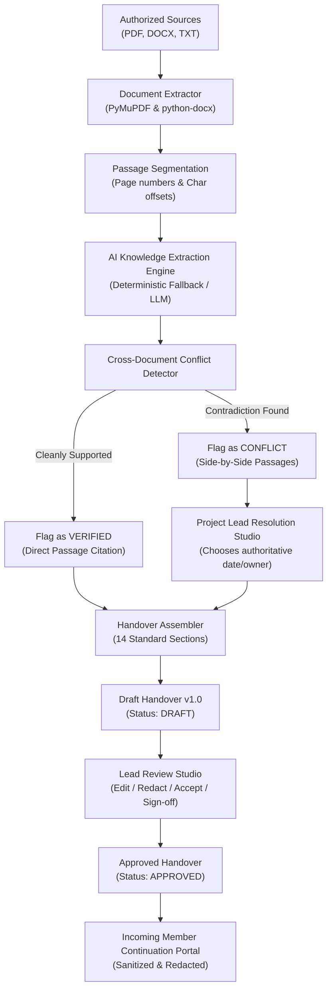
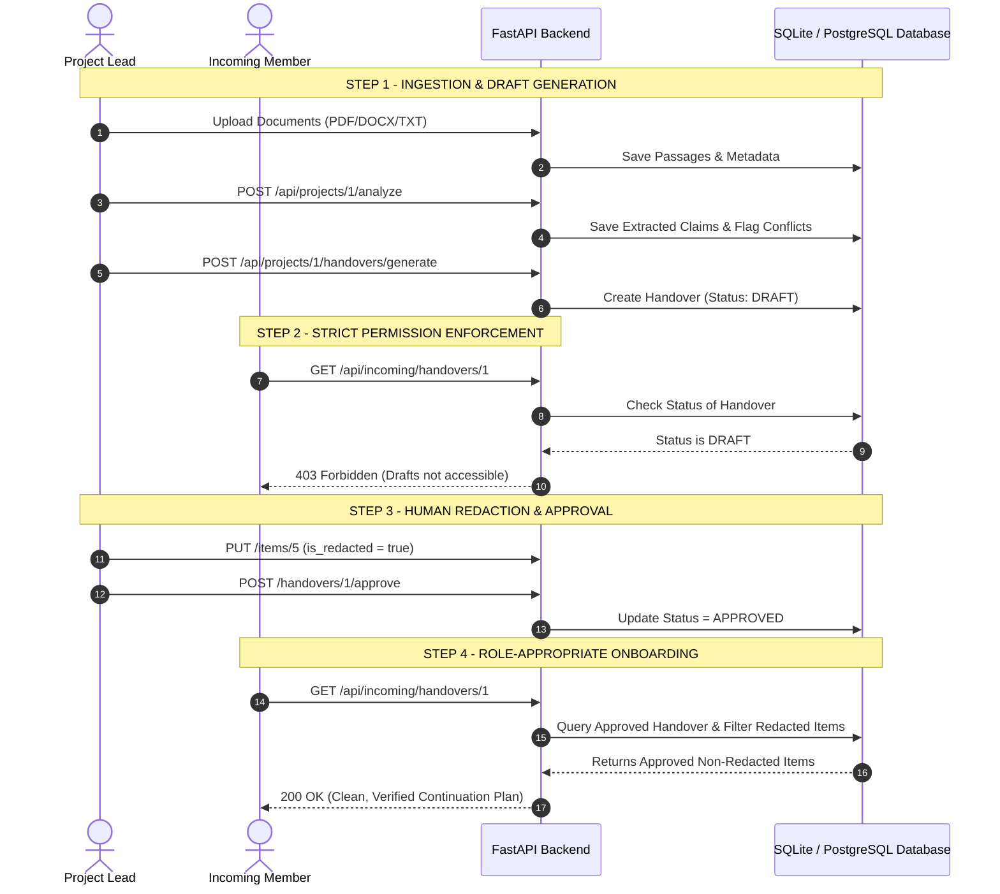

# KnowBridge Data Flow & Processing Lifecycle
**Tech Titan | Individual Participant | Hackathon Round 2**

---

## 1. End-to-End Processing Pipeline

```mermaid
flowchart TD
    A["Authorized Sources\n(PDF, DOCX, TXT)"] --> B["Document Extractor\n(PyMuPDF & python-docx)"]
    B --> C["Passage Segmentation\n(Page numbers & Char offsets)"]
    C --> D["AI Knowledge Extraction Engine\n(Deterministic Fallback / LLM)"]
    D --> E["Cross-Document Conflict Detector"]
    E -->|Contradiction Found| F["Flag as CONFLICT\n(Side-by-Side Passages)"]
    E -->|Cleanly Supported| G["Flag as VERIFIED\n(Direct Passage Citation)"]
    F --> H["Project Lead Resolution Studio\n(Chooses authoritative date/owner)"]
    G --> I["Handover Assembler\n(14 Standard Sections)"]
    H --> I
    I --> J["Draft Handover v1.0\n(Status: DRAFT)"]
    J --> K["Lead Review Studio\n(Edit / Redact / Accept / Sign-off)"]
    K --> L["Approved Handover\n(Status: APPROVED)"]
    L --> M["Incoming Member Continuation Portal\n(Sanitized & Redacted)"]
```

---

## 2. Role-Based Access Barrier

```mermaid
sequenceDiagram
    autonumber
    actor Lead as Project Lead
    actor Incoming as Incoming Member
    participant API as FastAPI Backend
    participant DB as SQLite / PostgreSQL Database

    Note over Lead,DB: STEP 1 - INGESTION & DRAFT GENERATION
    Lead->>API: Upload Documents (PDF/DOCX/TXT)
    API->>DB: Save Passages & Metadata
    Lead->>API: POST /api/projects/1/analyze
    API->>DB: Save Extracted Claims & Flag Conflicts
    Lead->>API: POST /api/projects/1/handovers/generate
    API->>DB: Create Handover (Status: DRAFT)

    Note over Incoming,API: STEP 2 - STRICT PERMISSION ENFORCEMENT
    Incoming->>API: GET /api/incoming/handovers/1
    API->>DB: Check Status of Handover #1
    DB-->>API: Status is DRAFT
    API-->>Incoming: 403 Forbidden (Drafts not accessible)

    Note over Lead,DB: STEP 3 - HUMAN REDACTION & APPROVAL
    Lead->>API: PUT /items/5 (is_redacted = true)
    Lead->>API: POST /handovers/1/approve
    API->>DB: Update Status = APPROVED

    Note over Incoming,DB: STEP 4 - ROLE-APPROPRIATE ONBOARDING
    Incoming->>API: GET /api/incoming/handovers/1
    API->>DB: Query Approved Handover & Filter Redacted Items
    DB-->>API: Returns Approved Non-Redacted Items
    API-->>Incoming: 200 OK (Clean, Verified Continuation Plan)
```
